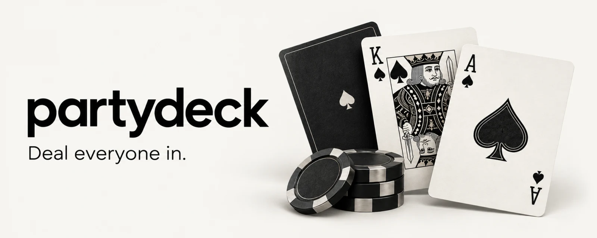
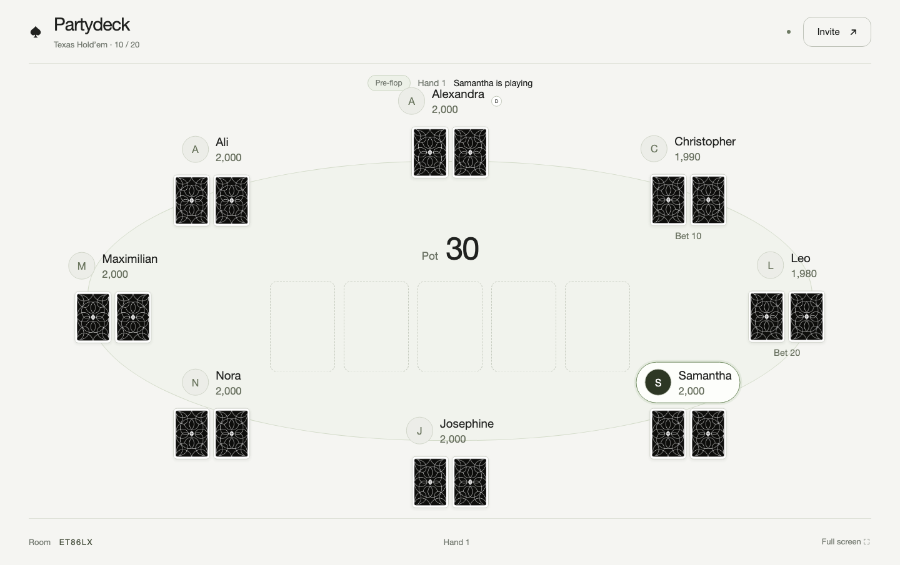
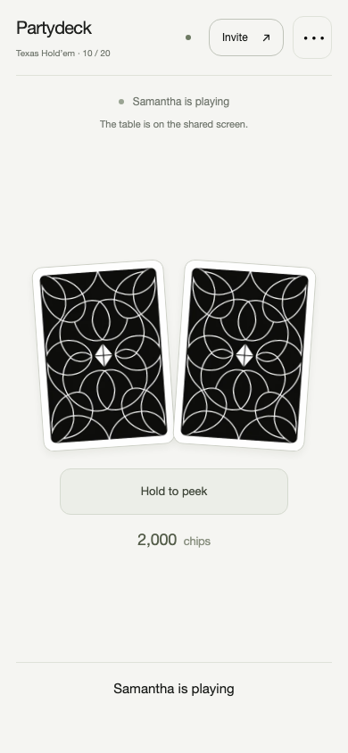

<p align="center">
  
</p>

<p align="center">
  <strong>A card night, with everyone at the table.</strong><br>
  Texas Hold'em and blackjack in your browser. A shared screen for the table. Your phone for your hand.
</p>

<p align="center">
  <a href="https://partydeck-game.up.railway.app"><strong>Play Partydeck ↗</strong></a>
  &nbsp; · &nbsp;
  <a href="#run-it-yourself">Run it yourself</a>
  &nbsp; · &nbsp;
  <a href="#how-it-works">How it works</a>
  &nbsp; · &nbsp;
  <a href="#under-the-table">Explore the code</a>
</p>

<p align="center">
  
  
  
</p>

---

## Same room. Everyone's in.

Start a table, share the QR code, and let your friends join with a nickname. No app to install. No account required to play.

- **Two games.** No-limit Texas Hold'em for 2–8 players, or blackjack for 1–8 against an automatic dealer.
- **Private hands.** Hold to peek at your poker cards. Release to hide them.
- **An optional big screen.** Use a laptop, tablet, or TV browser as the table. Everyone plays on their own phone. Without a spare screen, choose phone-only mode.
- **A proper game night.** Turn indicators, hand results, host controls, chip refills, and a 30-second reconnection window.
- **A profile worth keeping.** Saved statistics and eight cosmetic achievements. Guests can save their progress to an account.
- **An original deck.** All 52 card faces and a shared back, with small responsive WebP assets for gameplay.

<table>
  <tr>
    <td width="73%" valign="top"></td>
    <td width="27%" valign="top"></td>
  </tr>
  <tr>
    <td align="center">The table everyone sees.</td>
    <td align="center">The hand only you see.</td>
  </tr>
</table>

<sub>Actual app screenshots using local test players. The cover artwork is generated.</sub>

## How it works

**1. Pick a game.** Create a room and choose whether this device is the shared table or a player's screen.

**2. Invite your friends.** Share the link or six-character room code, or scan the QR code. A shared display never takes a player seat. The first phone to join becomes the host.

**3. Deal.** The host starts the hand. The server handles rules, turns, shuffling, and settlement. Host controls can move to another player from the table menu.

Every chip is virtual and has no cash value. There are no deposits, withdrawals, or real-money settlement.

## Run it yourself

Requires **Node.js 24+** and npm. Guest play and local username accounts work without an external authentication provider.

```sh
git clone https://github.com/zabrodsk/partydeck.git
cd partydeck
npm ci --ignore-scripts
PORT=4317 npm start
```

Open **http://localhost:4317**. To join from phones, use the same Wi-Fi network and keep the computer awake. Invitations created on localhost use the computer's LAN address. A hosted HTTPS deployment lets friends join over the internet.

### Configuration

| Variable | Purpose | Default |
| --- | --- | --- |
| `PORT` | HTTP listening port | `3000` |
| `DATA_PATH` | Persistent SQLite database | `data/table.sqlite` |
| `PUBLIC_URL` | External origin used for hosted links and authentication | Local network discovery |
| `NODE_ENV` | Set to `production` for production asset handling | Unset |
| `WORKOS_API_KEY` | Optional WorkOS API key | Disabled |
| `WORKOS_CLIENT_ID` | Optional WorkOS client ID | Disabled |
| `WORKOS_COOKIE_PASSWORD` | Optional session-sealing secret, at least 32 characters | Disabled |

Set variables in your shell or hosting provider. Never commit credentials or a live database.

<details>
<summary><strong>Optional WorkOS AuthKit setup</strong></summary>

Create your own WorkOS project and configure the matching environment's API key, client ID, and cookie password. Set `PUBLIC_URL` to your app's origin, then configure:

- Callback: `<PUBLIC_URL>/auth/callback`
- Initiate login: `<PUBLIC_URL>/auth/login`
- Homepage and logout: `<PUBLIC_URL>`

The Node integration uses PKCE, single-use browser-bound state, and sealed HTTP-only sessions. It can attach a WorkOS identity to an existing guest profile. It does not link accounts merely because email addresses match.

The hosted playtest currently uses a staging environment. Staging and production accounts are separate. The experimental Worker adapter does not include the Node AuthKit integration.

</details>

## Under the table

```text
Browser screens                   Node server
Shared display + private phones   Authoritative game state
          │                                 │
          ├──── HTTP actions ──────────────► Rules + settlement
          ◄──── Server-sent events ──────── Filtered player views
                                            │
                                          SQLite
```

| Location | What's inside |
| --- | --- |
| [`public/`](public/) | Browser-native HTML, CSS, JavaScript, and the original deck |
| [`server/`](server/) | Node HTTP server, room lifecycle, poker, blackjack, profiles, and AuthKit |
| [`test/`](test/) | Game, privacy, storage, HTTP, motion, and responsive checks |
| [`assets/`](assets/) | Generated artwork, source images, and prompt records |
| [`worker/`](worker/) | Experimental Cloudflare Worker adapter |
| [`db/`](db/) and [`drizzle/`](drizzle/) | D1 schema and migrations for the Worker adapter |

Hold'em runs on `poker-ts`. Blackjack is implemented in the project. GSAP handles gameplay card motion and respects reduced-motion preferences. The landing-page cards stay static. Private hands and dealer hole cards are filtered on the server before any state reaches a client.

### Hosting

The live app runs on Railway using the included [Dockerfile](Dockerfile). Mount a persistent volume at `/app/data`, set `DATA_PATH=/app/data/table.sqlite`, and set `PUBLIC_URL` to the HTTPS origin.

Run **one Node replica**. Active games live in one process. After a restart, unfinished Node games are cancelled and their starting stacks refunded. Horizontal scaling needs a different room-state architecture.

The optional Worker/D1 adapter persists accepted actions and restores hands across requests. To explore it locally:

```sh
npm run build
npm run dev:sites
```

It is experimental and is not the live Railway runtime. Configure your own Cloudflare bindings before deploying it.

## Game rules

<details>
<summary><strong>Texas Hold'em</strong> · 2–8 players</summary>

- No-limit betting, 2,000 starting chips, fixed 10/20 blinds.
- Server-settled side pots, split pots, and odd chips.
- Only winning showdown cards become public. An uncontested winner keeps their hand private.
- Host-controlled next hands and refills to 2,000 between hands.
- After the reconnection grace period, a disconnected player checks when free or folds facing a bet. All-in hands remain eligible.

</details>

<details>
<summary><strong>Blackjack</strong> · 1–8 players</summary>

- Automatic dealer, fresh six-deck shoe each hand, dealer stands on soft 17.
- Naturals pay 3:2; other wins pay 1:1; ties return the stake. Bets use even amounts for whole-chip payouts.
- Double on the first two cards, including after splits. Split equal ranks into up to four hands.
- Split aces receive one card each and cannot be resplit. Split 21 pays 1:1.
- No insurance or surrender. Disconnected players stand after the grace period.

</details>

## Checks

```sh
npm test
```

The suite covers settlement, side pots, chip conservation, private views, stale and duplicate actions, reconnection, host recovery, restart refunds, authentication, and HTTP streams.

Browser checks use a separately installed Playwright with browser binaries. Point `PLAYWRIGHT_MODULE` at its entry module:

```sh
PLAYWRIGHT_MODULE=/path/to/playwright/index.mjs node test/browser.mjs
PLAYWRIGHT_MODULE=/path/to/playwright/index.mjs node test/responsive.mjs
PLAYWRIGHT_MODULE=/path/to/playwright/index.mjs node test/motion-browser.mjs
```

For `test/performance.mjs`, start the app first and set `TEST_BASE` to its URL. Browser screenshots and reports go into the ignored `output/` directory.

## Current limits

Partydeck is a playable project for private game nights. Room chips do not carry into a persistent bankroll. Legacy username accounts have no built-in password recovery. Large-scale load testing and physical multi-device acceptance remain future work.

## Credits

- [poker-ts](https://github.com/claudijo/poker-ts) for the Hold'em engine.
- [GSAP](https://gsap.com/) for gameplay animation.
- [card-motion](https://cards.franpiaggio.com/) by Francisco Piaggio for the extracted fan geometry. Its MIT notice is retained in [`public/vendor/card-motion/LICENSE`](public/vendor/card-motion/LICENSE).
- [WorkOS](https://workos.com/) for optional hosted authentication.
- Built-in imagegen for the original deck and README cover. The [cover prompt](docs/readme/generation.json) is included.

Third-party components retain their respective licenses. Public availability of this repository does not grant an additional license to its original code or artwork.

---

<p align="center"><strong>Good cards. Better company.</strong><br><a href="https://partydeck-game.up.railway.app">Start a table ↗</a></p>
